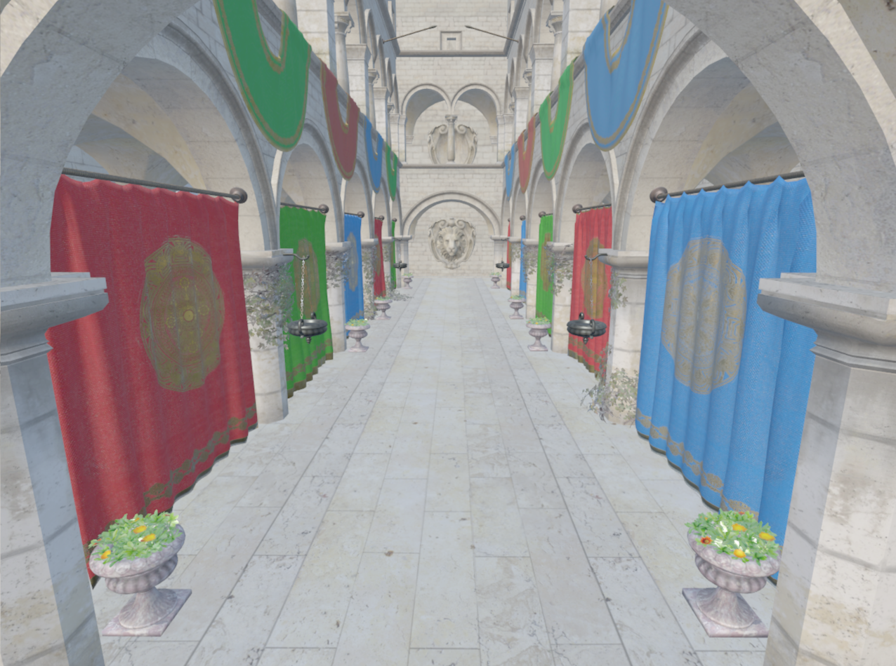
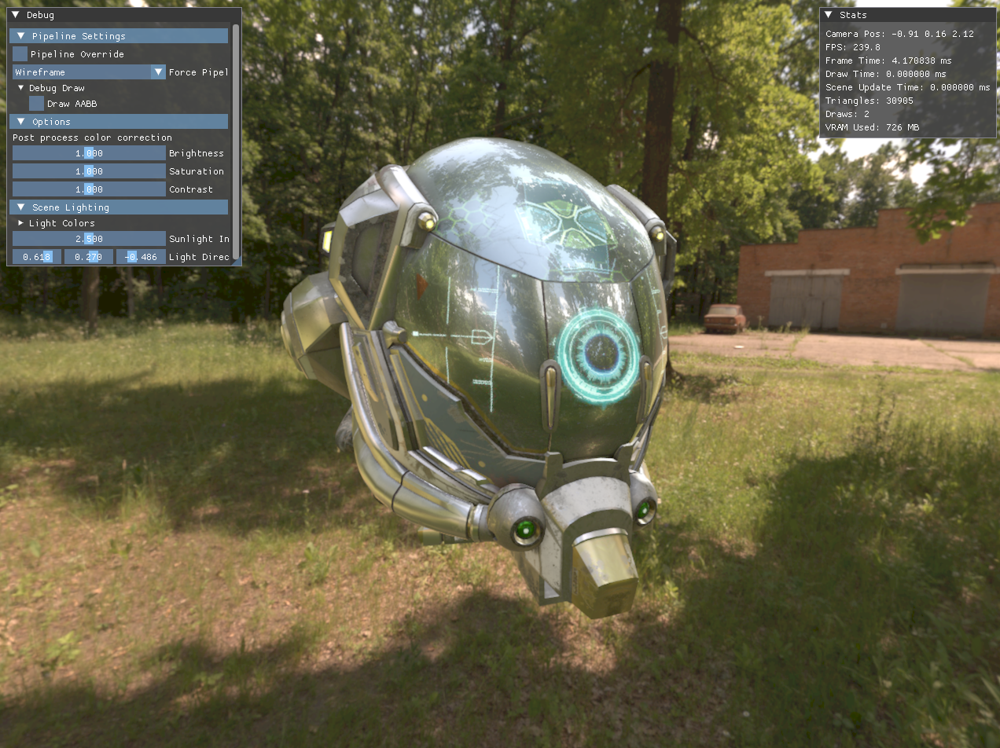

## Features
- Vulkan 1.4 Hybrid CPU/GPU-Driven renderer
- GPUAddress table enables a 100% bindless indirect buffer system
- Batched indirect instancing via `vkCmdDrawIndexedIndirect`
- Descriptor indexing (bindless rendering)
- Multithreading (EnkiTS)
- Transfer and compute async capable
- PBR + IBL: Cook–Torrance GGX with Disney diffuse; split-sum IBL (prefiltered spec + BRDF LUT, irradiance)
- GLTF asset pipeline
- AABB visual debug and culling
- Transparent depth sorting
- ImGui debugging tools
- MSAA (up to 8x), mipmapping, dynamic pipeline swapping

## Future
-SSAO
-Cascaded shadow mapping
-Improved tone mapping
-SDL2 integration
-Push descriptors
-Better asset management (dynamic asset loading, resource handling)
-KTX texture format
-Proper multithreading (texture loading, cmd recording)
-Render graph
-Occlusion culling (Hi-Z/HZB)
-GPU frustum culling
-GPU batching and sorting
-Clustered/Forward+ shading

## Screenshots

## Controls
- `W A S D` ‐ Move forward, left, back, right  
- `Space` ‐ Move up  
- `Ctrl` ‐ Move down  
- `Mouse (Left Click + Move)` ‐ Look around  
- `R` ‐ Reset camera to spawn/origin  
- `Tab` ‐ Toggle ImGui editor setting  
- `P` ‐ Toggle rendering stats  
- `Esc` ‐ Exit application

## Requirements for build
- Windows 10+
- Vulkan SDK (1.4+)
- Visual Studio 2022

## Build steps
Open project file in visual studio 2022
Cmake to be utilized in future, doesn't currently work