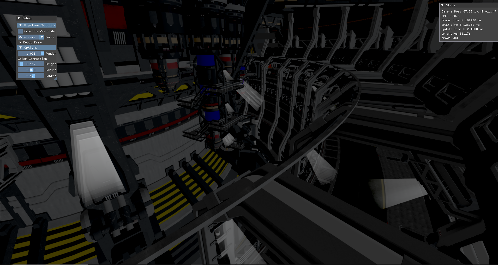
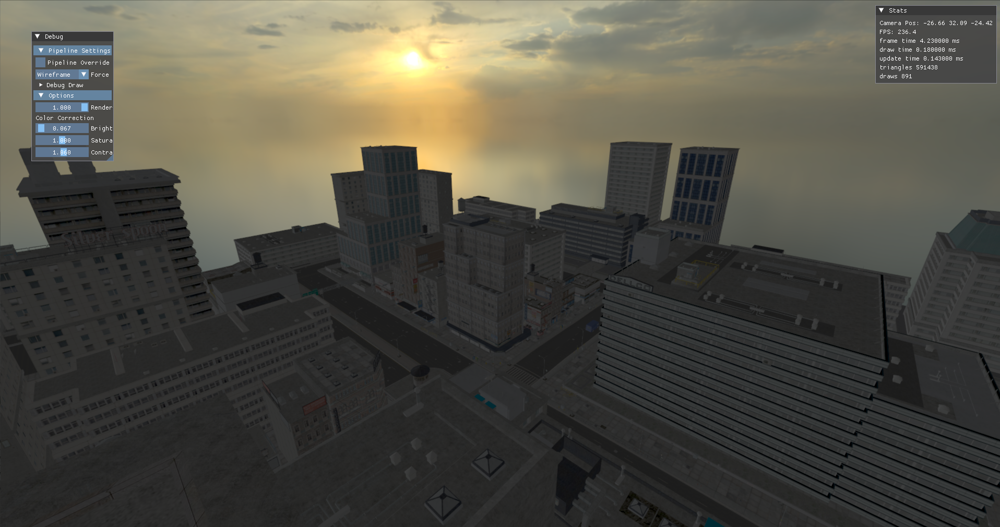
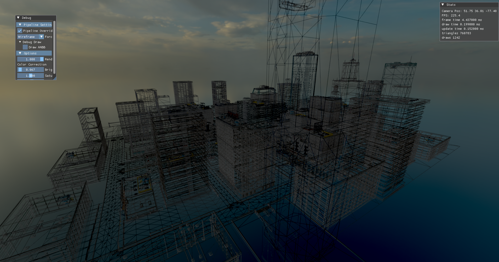

# VulkanEngine

A real-time Vulkan renderer written in C++20 using modern rendering techniques. Features a modular rendering architecture, compute-based post-processing, ImGui integration, MSAA, and full glTF support.

Originally built off the Vulkan tutorial up to the triangle stage, I then modularized the entire setup into a `Backend` namespace. From there, I split Vulkan systems during a major refactor.

The engine truly came together after integrating ideas from [vkguide.dev](https://vkguide.dev/), allowing me to build a scalable framework and explore more advanced rendering techniques.

## Features

- Vulkan 1.3 renderer
- MSAA (up to 8x)
- glTF / GLB model loading
- Compute shader-based post-processing
- ImGui debug UI
- Color blending and multisampling
- Mipmapping
- AABB frustum culling
- Transparent depth sorting
- Dynamic pipeline swapping
- HDR environmental mapping
- Modular Vulkan backend, pipeline, and descriptor setup

## Screenshots





## Controls
- `W A S D` – Move forward, left, back, right  
- `Space` – Move up  
- `Ctrl` – Move down  
- `Mouse (Left Click + Move)` – Look around  
- `R` – Reset camera to spawn/origin  
- `Esc` – Exit application

## Requirements for build

- Windows 10+
- Vulkan SDK (1.3+)
- CMake 3.20+
- Visual Studio 2022

## Build steps

```bash
mkdir build
cd build
cmake .. -G "Visual Studio 17 2022" -A x64
cmake --build . --config Release/Debug