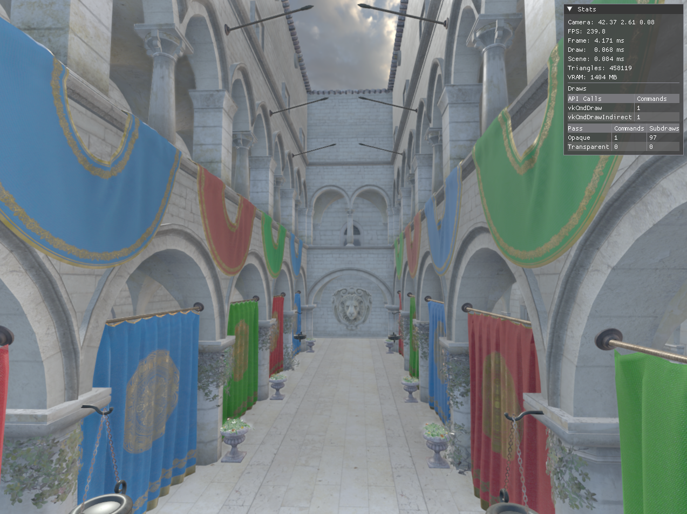
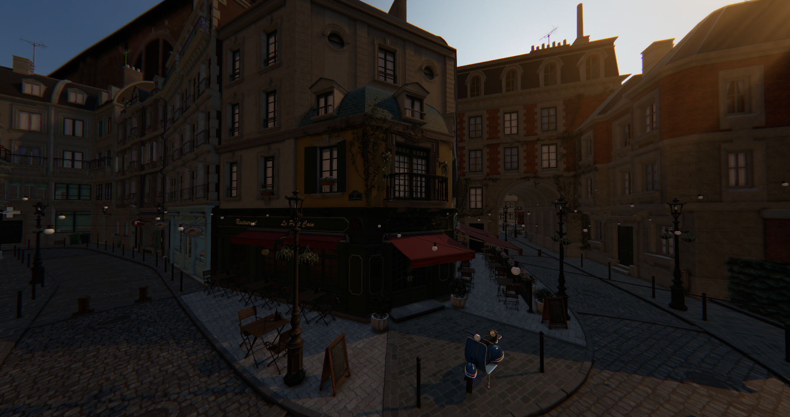
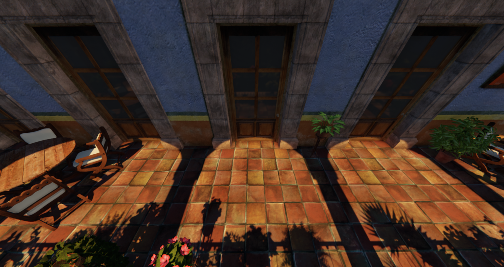
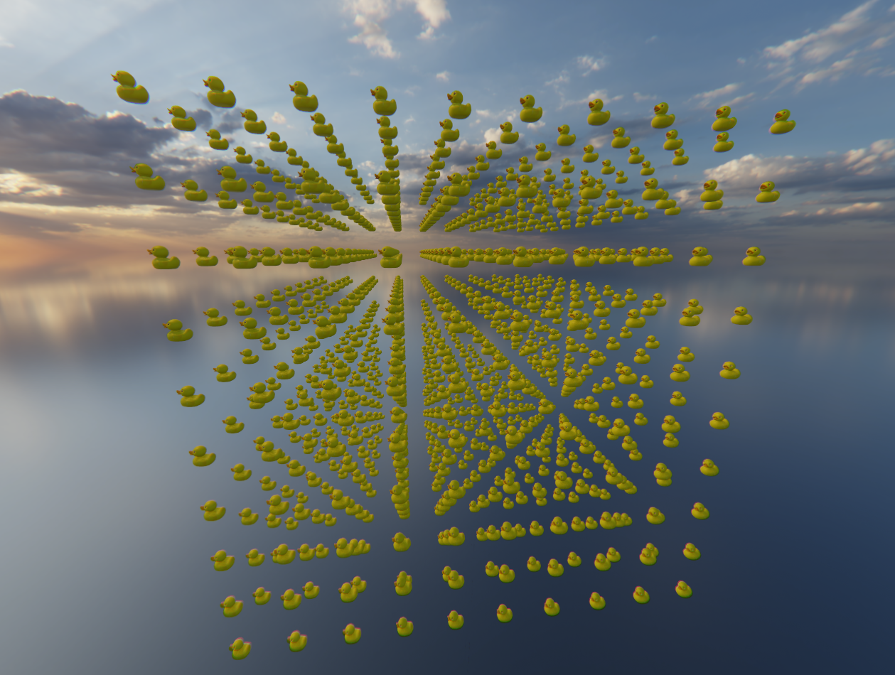

## Features

### Rendering Architecture

* Vulkan 1.4 GPU-driven renderer
* Mesh shader pipeline with visibility-buffer deferred rendering
* GPU address table enabling a fully bindless indirect buffer architecture
* GPU-driven instance culling and draw-command generation
* Descriptor indexing for bindless resource access
* Push descriptors for transient/runtime render targets
* Retained-mode render graph
* Async compute with multithreaded secondary command-buffer recording
* Multithreaded job system powered by EnkiTS

### Lighting & Shading

* Physically based rendering using Cook–Torrance GGX with Disney diffuse
* Split-sum image-based lighting with prefiltered specular environment maps and BRDF LUT
* Spherical harmonic irradiance for diffuse environment lighting
* Clustered lighting for point, spot, and area lights
* Screen-space global illumination using visibility-bitmask AO with indirect lighting (XeGTAO-based)
* Ray-traced reflections with NRD REBLUR denoising
* Ray-traced soft sun shadows with NRD SIGMA denoising
* Cascaded shadow maps with PCF and PCSS filtering
* Screen-space contact shadows based on Bend Studio's technique
* Shadow-mapped flashlight
* Ray-marched directional volumetric lighting

### Geometry & Visibility

* Meshoptimizer-based mesh processing
* GPU Hi-Z depth pyramid generation
* GPU-driven visibility and occlusion culling
* Forward+ transparent rendering
* Order-independent transparency (OIT)
* Debug rendering for OBBs, wireframes, and other scene geometry

### Temporal & Post Processing

* Temporal anti-aliasing (TAA)
* Contrast Adaptive Sharpening (CAS)
* ACES Film tonemapping
* Bloom
* Lens flare
* Chromatic aberration
* Spartan Engine-inspired bloom and chromatic aberration implementations

### Assets & Tooling

* glTF 2.0 cached asset pipeline
* Block-compressed texture support
* ImGui debugging and renderer controls
* Tracy CPU/GPU profiling integration

> **Legacy rendering paths**
>
> Older anti-aliasing implementations are retained for reference, testing, and comparison. They are not part of the current rendering pipeline.

* SMAA
* CMAA2 (Intel)
* FXAA

## Future

* Runtime asset loading and management
* Dynamic mesh, material, and light interactions
* Auto exposure
* Gran Turismo 7-style tonemapping
* Physically based light units
* Atmospheric scattering sky and sun model
* Planar reflections
* Parallax-corrected cubemaps
* Water rendering
* Froxel Volumetrics
* DLSS
* Ray-traced global illumination (RTGI)
* Restir lighting
* Ray-traced transmission

## Screenshots

## Controls

* `W A S D` - Move forward, left, backward, and right
* `Space` - Move up
* `Ctrl` - Move down
* `Right Click + Mouse` - Look around
* `R` - Reset camera to spawn/origin
* `Tab` - Toggle ImGui editor
* `P` - Toggle ImGui profiling/statistics window
* `F` - Toggle flashlight
* `Esc` - Exit application

## Build Requirements

* Windows 10/11
* NVIDIA RTX 20-series+ or AMD RDNA 2+
* Vulkan SDK 1.4 or newer
* CMake 4.2 or newer
* Visual Studio 2026

## **Build Steps**

1. git clone https://github.com/Jwill724/VK_Mark-3.git

2. cd VK_Mark-3

3. cmake -S . -B build -G "Visual Studio 18 2026" -A x64

4. cmake --build build --config Release

5. Open `build/VulkanRenderer.sln` in Visual Studio 2026.

### Assets

Bistro and San Miguel assets:

https://www.dropbox.com/scl/fo/2h6jnyho16z7w0lpjah9w/AIV4BUCfhIbN1sC1hEYl8BI?rlkey=4zdox8dw65t7n5hejpvm4nepz&st=q4nrzvub&dl=0

Intel Sponza can be downloaded from Intel's Graphics Research samples and loaded directly as glTF:

https://www.intel.com/content/www/us/en/developer/topic-technology/graphics-research/samples.html
