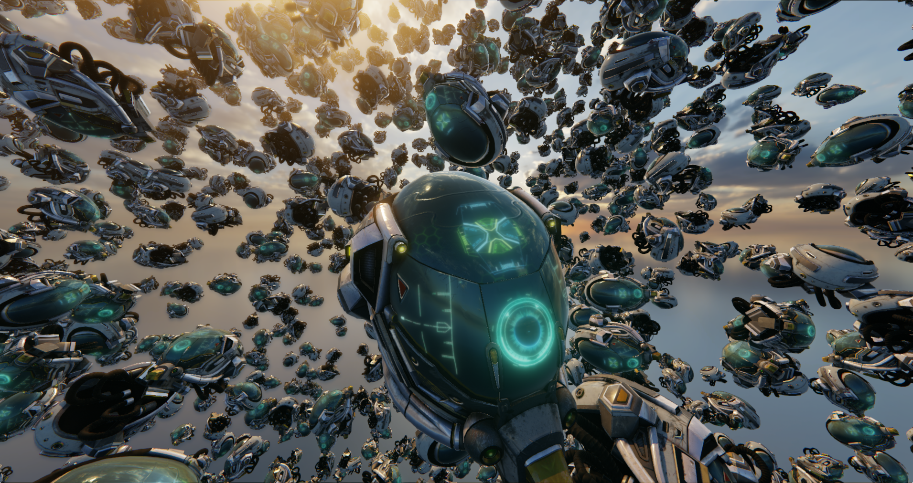

## Features
- Vulkan 1.4 Hybrid CPU/GPU-Driven forward+ renderer
- GPUAddress table enables a 100% bindless indirect buffer system
- Batched indirect instancing via `vkCmdDrawIndexedIndirect`
- Clustered shading
- Descriptor indexing (bindless rendering)
- PBR + IBL: Cook–Torrance GGX with Disney diffuse; split-sum IBL (prefiltered spec + BRDF LUT, irradiance)
- GLTF asset pipeline enabled (kinda) with multithreading (EnkiTS)
- AABB BVH culling and OBB visual debug
- Order-independent-transparency (OIT)
- ImGui debugging tools
- SMAA
- CMAA2 (Intel)
- FXAA
- Cascaded shadow mapping via atlas
- Flashlight with shadow map
- Screen space contact shadows (Bend Studios)
- Visibility bitmask ambient occlusion + bent normals (XeGTAO based)
- Ray marched directional volumetric lights
- Tonemapping (ACES Film)
- Push descriptors handling runtime render targets
- HI-Z Generation (Depth mip pyramid)
- Lens Flare
- Chromatic Aberration (Spartan Engine implementation)
- Mesh optimizer
- Tracy profiler

## Future
-A True Render Graph
-Full GPU culling with draw building
-Runtime asset loading and handling
-Dynamic meshes, material and light interactions
-Async compute (compute passes during shadow depth)
-KTX texture format
-Deeper multithreading (texture loading, cmd recording)
-Auto Exposure
-Grand Turismo 7 tonemapping
-Physically based light units
-Atmospheric scattering sky with sun
-Bloom
-SSGI
-SSR
-Planar reflections
-Parallax corrected cubemaps
-Water shaders
-Voxel volumetrics
-Make TAA work well
-Improvements to lens flare quality
-Ray traced reflections

## Screenshots

## Controls
- `W A S D` ‐ Move forward, left, back, right
- `Space` ‐ Move up
- `Ctrl` ‐ Move down
- `Mouse (Right Click + Move)` ‐ Look around
- `R` ‐ Reset camera to spawn/origin
- `Tab` ‐ Toggle ImGui editor setting
- `P` ‐ Toggle ImGui stats profiling window
- `F` ‐ Toggle flashlight
- `Esc` ‐ Exit application

## Requirements for build
- Windows 10+
- Discrete GPU with 6gb+ vram
- Vulkan SDK (1.4+)
- Visual Studio 2026

## Build steps
Open project file in visual studio 2026
Cmake to be utilized in future, doesn't currently work.

For Bistro asset (tree is busted)
https://www.dropbox.com/scl/fi/aozfte8k1aewhpl7omx3r/Bistro.glb?rlkey=wmy6ep2yezcs77bidxwqeeiec&st=ztk7qxun&dl=0