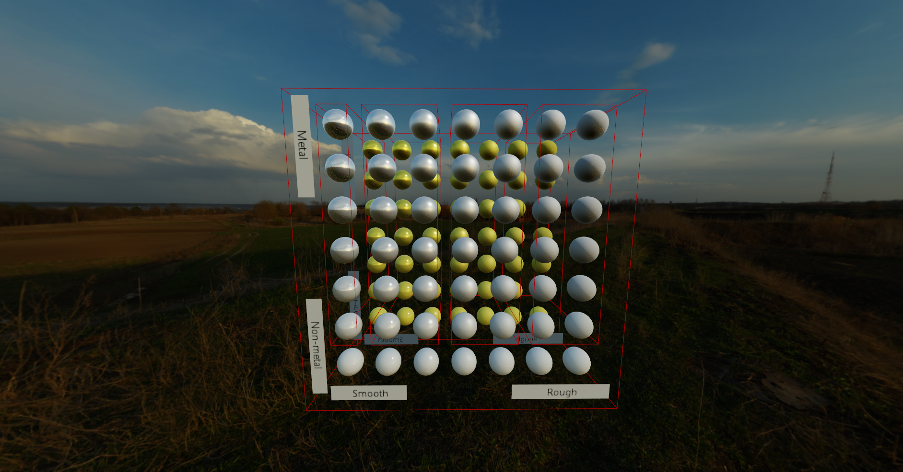

## Features
- Vulkan 1.4 Hybrid CPU/GPU-Driven forward renderer
- GPUAddress table enables a 100% bindless indirect buffer system
- Batched indirect instancing via `vkCmdDrawIndexedIndirect`
- Descriptor indexing (bindless rendering)
- PBR + IBL: Cook–Torrance GGX with Disney diffuse; split-sum IBL (prefiltered spec + BRDF LUT, irradiance)
- GLTF asset pipeline enabled (kinda) with multithreading (EnkiTS)
- AABB BVH culling and OBB visual debug
- Transparent depth sorting
- ImGui debugging tools
- MSAA (up to 8x)
- Cascaded shadow mapping
- SSAO
- Tonemapping (ACES Film)
- Push descriptors

## Future
-Render graph
-SDL2 integration and platform layer
-Better asset management (dynamic asset loading, resource handling)
-KTX texture format
-Full compute async
-Proper multithreading (texture loading, cmd recording)
-Occlusion culling (Hi-Z/HZB)
-GPU frustum culling
-GPU batching and sorting
-Clustered/Forward+ shading

## Screenshots

## Controls
- `W A S D` ‐ Move forward, left, back, right  
- `Space` ‐ Move up  
- `Ctrl` ‐ Move down  
- `Mouse (Left Click + Move)` ‐ Look around  
- `R` ‐ Reset camera to spawn/origin  
- `Tab` ‐ Toggle ImGui editor setting  
- `P` ‐ Toggle rendering stats  
- `Esc` ‐ Exit application

## Requirements for build
- Windows 10+
- Vulkan SDK (1.4+)
- Visual Studio 2022

## Build steps
Open project file in visual studio 2022
Cmake to be utilized in future, doesn't currently work.

For Bistro asset
https://www.dropbox.com/scl/fi/hmrtvev8jw6k74wvcojkb/Bistro.glb?rlkey=djv8g8jjsag9cbxuh0pboqmyd&e=1&st=l9ysxwvt&dl=0