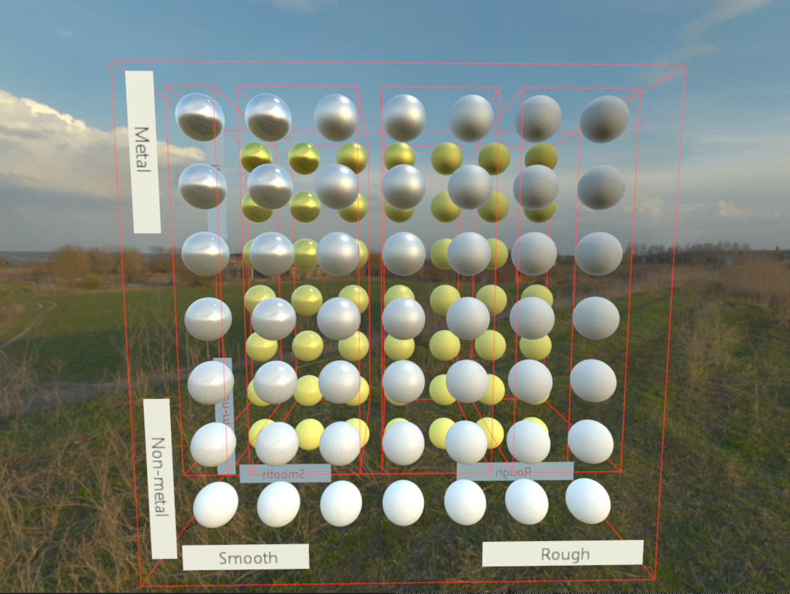

## Features
- Vulkan 1.4 GPU-Driven renderer
- GPUAddress table enables a 100% bindless indirect buffer system
- Batched indirect instancing via `vkCmdDrawIndexedIndirect`
- Descriptor indexing (bindless rendering)
- Multithreaded asset & command preparation (EnkiTS)
- Transfer and compute async capable
- PBR shading (Cook-Torrance BRDF, GGX, Schlick-GGX, Unreal Fresnel)
- Full IBL support (irradiance map + specular prefilter + BRDF LUT)
- GLTF asset pipeline
- AABB frustum culling
- Transparent depth sorting
- ImGui debugging tools
- MSAA (up to 8x), mipmapping, dynamic pipeline swapping

## Future
-SSAO
-Cascade shadow mapping
-Improved tone mapping
-SDL2 integration
-Utilize push descriptors
-Better asset management (e.g dynamic asset loading)
-KTX texture format
-Proper multithreading (e.g texture loading, cmd recording)
-Render graph
-Occlusion culling
-GPU frustum culling
-GPU batching and sorting
-Clustered shading

## Screenshots

## Controls
- `W A S D` ‐ Move forward, left, back, right  
- `Space` ‐ Move up  
- `Ctrl` ‐ Move down  
- `Mouse (Left Click + Move)` ‐ Look around  
- `R` ‐ Reset camera to spawn/origin  
- `Tab` ‐ Toggle ImGui editor setting  
- `P` ‐ Toggle rendering stats  
- `Esc` ‐ Exit application

## Requirements for build
- Windows 10+
- Vulkan SDK (1.4+)
- Visual Studio 2022

## Build steps
Open project file in visual studio 2022
Cmake to be utilized in future, doesn't currently work